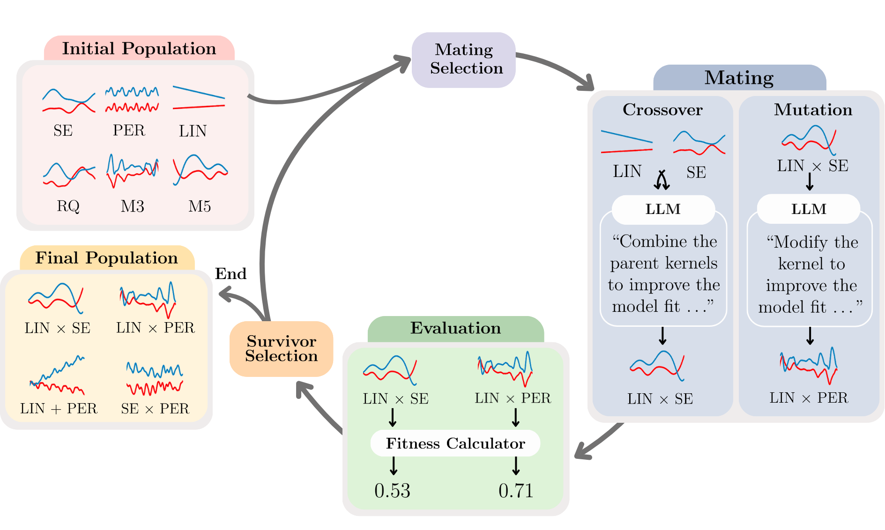

# 🍰 CAKE: Context-Aware Kernel Evolution

<div align="center">



**Adaptive Kernel Design for Bayesian Optimization Is a Piece of CAKE with LLMs**

<p align="center">
  <strong>✨ Accepted at NeurIPS 2025 ✨</strong>
</p>

[](https://arxiv.org/abs/2509.17998) 
[](https://huggingface.co/papers/2509.17998)
[](https://github.com/richardcsuwandi/cake)
<!-- [](https://x.com/HaoranLi_/status/1969831293748936998)  -->


[**Overview**](#overview) • [**Quick Start**](#quick-start) • [**Experiments**](#experiments)

</div>

We present **CAKE** (Context-Aware Kernel Evolution), a novel framework that leverages large language models to adaptively evolve Gaussian Process kernel functions for Bayesian optimization. CAKE combines evolutionary algorithms with LLM reasoning to automatically discover kernel structures that capture patterns in optimization landscapes.

## Overview

### Motivation

Selecting an appropriate Gaussian Process (GP) kernel is critical for ensuring effective exploration and exploitation in Bayesian optimization. However, this process typically requires significant domain expertise and manual effort. **CAKE** automates kernel selection by leveraging large language models (LLMs) to evolve kernel expressions, enabling the discovery of problem-specific kernel structures without manual intervention.

### Method

The CAKE framework follows an evolutionary process, which is summarized as follows:

| Step                       | Description                                                                                   |
|----------------------------|----------------------------------------------------------------------------------------------|
| **Initialization** | Initialize the population with a diverse set of base kernels                 |
| **Fitness evaluation**         | Evaluate each kernel using the fitness function on observed data           |
| **LLM-guided evolution**     | Apply crossover and mutation to kernel expressions, guided by LLM reasoning         |
| **Selection**                 | Retain high-performing kernels and proceed to the next generation                         |


## Quick Start

### Installation

```bash
# Clone the repository
git clone https://github.com/richardcsuwandi/cake.git
cd cake

# Set up environment variables
export OPENAI_API_KEY="your-api-key-here"

# Install dependencies (using uv)
curl -LsSf https://astral.sh/uv/install.sh | sh
uv pip install -r requirements.txt --python 3.9
```

### Basic Usage

```python
import torch
from cake import CAKE
from benchmark import get_objective

# Initialize CAKE
cake = CAKE(
    num_population=6,
    mutation_prob=0.7,
    model_name="gpt-4o-mini"
)

# Set up optimization problem
objective, bounds, _ = get_objective("ackley2")
train_x = torch.rand(10, 2) * 2 - 1
train_y = objective(train_x)

# Run kernel evolution
best_kernel = cake.run(train_x, train_y)
print(f"Best evolved kernel: {best_kernel}")

# Use for optimization
next_x = cake.get_next_query(bounds)
```

## Experiments
To run the experiments in our paper, you can execute the following Python scripts:

```bash
# Run on synthetic optimization functions
python exp.py 

# Run on hyperparameter optimization tasks
python hpobench_exp.py
```

## Requirements

- Python 3.9+
- OpenAI API key (or compatible LLM API)
- Dependencies: PyTorch, BoTorch, GPyTorch, OpenAI

## LLM Configuration

CAKE supports OpenAI models and compatible APIs. Configure your API key:

```bash
export OPENAI_API_KEY="your-api-key"
```

For other LLM providers, modify the CAKE initialization:
```python
cake = CAKE(
    model_name="your-model",
    api_base="your-api-endpoint"  # if using non-OpenAI API
)
```

## Citation

If you find this work useful, please consider leaving a ⭐ and cite our paper:

```bibtex
@article{suwandi2025cake,
  title={Adaptive Kernel Design for Bayesian Optimization Is a Piece of CAKE with LLMs},
  author={Richard Cornelius Suwandi and Feng Yin and Juntao Wang and Renjie Li and Tsung-Hui Chang and Sergios Theodoridis},
  journal={arXiv preprint arXiv:2509.17998},
  year={2025}
}
```

## License

This project is licensed under the [MIT License](LICENSE).
